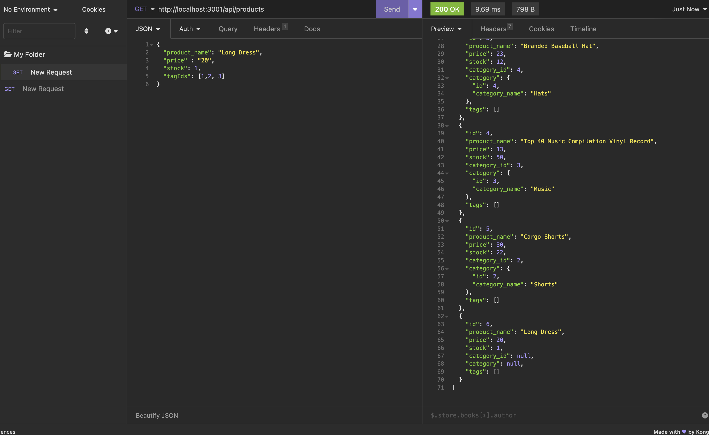

# Ecommerce-BackEnd

## Description

I built this application to learn more about the connection between server side api's and databases. This project also had a lot to do with ecommorce which is one of the  fastest growing industries as of now. This application allows you to store catalogue data.

## Table of Contents (Optional)

If your README is long, add a table of contents to make it easy for users to find what they need.

- [Installation](#installation)
- [Usage](#usage)
- [Credits](#credits)
- [License](#license)

## Installation

To invoke the application run the following commands in your terminal: 
- npm install
- mysql -u root -p (enter password)
- npm "schema file"
- npm run seed
- npm start

The user will have also needed to install: mysql, insomnia, and sequilize

## Usage

Here is a walkthrough video demonstrating how to use the application: 
https://drive.google.com/file/d/1YC_p7m7rbqeTKPjexWVUAYeNqKoIZYlt/view

The following image is of using the application through insomnia:

## Credits

- for all installations: https://www.npmjs.com/package/express-async-handler
- My tutor Mila and ask bcs learning assistants

## License

For more information refer to the documentation in Repo: https://mit-license.org/

## How to Contribute

The [Contributor Covenant](https://www.contributor-covenant.org/) is an industry standard
